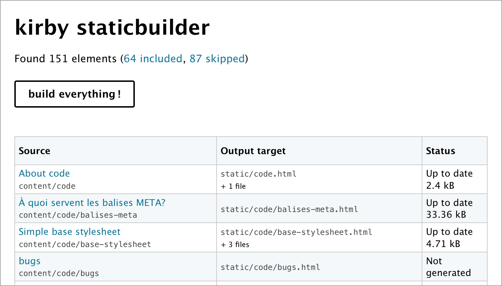

StaticBuilder Plugin for Kirby CMS
==================================

- Converts your Kirby CMS site to static files: HTML, assets, etc.
- Supports multilingual websites.

How it works
------------

You have a Kirby-powered site. You can [add your content][KIRBY_DOC_CONTENT] manually in the `content` folder or use the Panel. You can [use a theme][KIRBY_THEMES] or write your own templates and styles. You can preview your website using a local development server such as MAMP or WAMP.

Kirby StaticBuilder doesn’t change any of that. It gives you a basic HTML interface which enables you to build all your site’s pages and write the result in a folder named, you guessed it: `static`.

Note: to get the right result for your site and needs, you may need to tweak some options.

Installation and usage
----------------------

StaticBuilder requires Kirby 2.3.1 or later.

1.  [Download a ZIP of the latest release][DOWNLOAD_PAGE], rename the folder to `staticbuilder` and put it in your project’s `site/plugins` folder. (Alternatively, you can install this plugin with the [Kirby CLI][KIRBY_CLI], or [with Composer][DOC_COMPOSER].)

2.  Enable the plugin: see the [options documentation][DOC_OPTIONS]. (It’s simple really, but we probably don’t want to enable it for a live website!)

3.  Load `http://localhost/staticbuilder` in a web browser (where `localhost` is the domain where you can see your Kirby site; it might be different depending on the test server you use or how you configured it). You should see a list of pages. Check that these are indeed pages you want to export as HTML, and tweak the [options][DOC_OPTIONS] if needed.

4.  Hit the “Build” button. Hopefully things will work alright. If you have many pages (e.g. a few hundred), it might take a few seconds.

Note: every time you do a full build, the content of the `static` folder will be deleted. Don’t make changes there, or you will lose this work!

Documentation
-------------

-   [StaticBuilder options][DOC_OPTIONS]
-   [Best practices for static sites][DOC_STATIC]
-   [Optional: Installing with Composer][DOC_COMPOSER]

Known issues
------------

### Script timeout

Building a lot of pages, or sometimes just a few pages, can be intensive. In particular, if you’re making a lot of *thumbs* (resizing images in PHP), the script can time out.
 
Workaround for thumbs: try visiting those pages first to build the thumbs, and start the static build after that.

### Script interrupted by a redirect

If you use Kirby’s `go()` function, or `Redirect::to()` or `Header::redirect()` from the Kirby Toolkit, the script will be interrupted by an `exit;` statement and you will get redirected to a different page.

For a workaround, see [our best practice for HTTP redirections][DOC_STATIC_REDIR].

### Buggy page blocks the whole build

If your templates or plugins have uncaught PHP Exceptions or PHP errors, generating the HTML pages will be stopped.

For instance, if you’re building 10 pages and the third one has an error, only the first 2 will be built and written to the `static` folder.) To prevent that:

1.  Fix errors. :)
2.  Or exclude the buggy page(s) from the static build, using the `filter` option.

### Other issues

See the [list of issues][ISSUES], and if nothing matches please create a new one (you will need a GitHub account).

[DOC_STATIC]: doc/static.md
[DOC_STATIC_REDIR]: doc/static.md#http-redirections
[DOC_OPTIONS]: doc/options.md
[DOC_COMPOSER]: doc/composer.md
[DOWNLOAD_PAGE]: https://github.com/fvsch/kirby-staticbuilder/releases/latest
[ISSUES]: https://github.com/fvsch/kirby-staticbuilder/issues
[KIRBY_CLI]: https://github.com/getkirby/cli
[KIRBY_DOC_CONTENT]: https://getkirby.com/docs/content/adding-content
[KIRBY_THEMES]: http://www.getkirby-themes.com/
